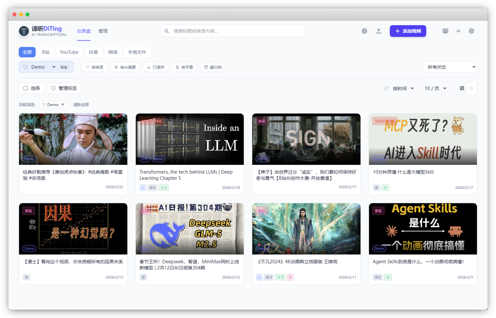
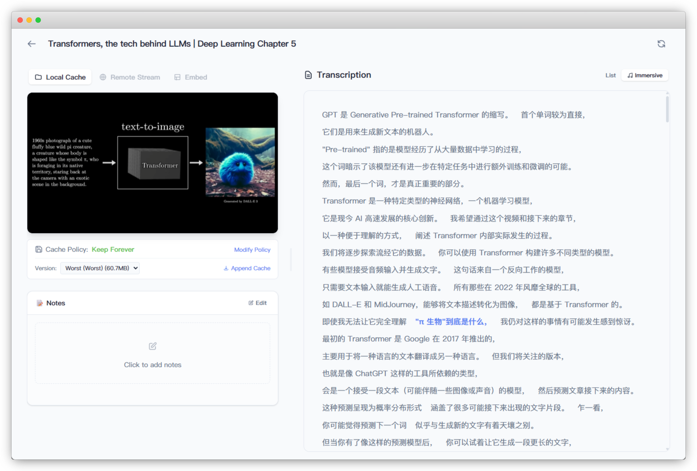

<div align="center">

# 谛听 DiTing

**你的私人视频知识库 — 本地 ASR · AI 分析 · 沉浸式阅读**

[](https://github.com)
[](https://python.org)
[](https://react.dev)
[](LICENSE)

</div>

> **谛听**，佛教神话中地藏菩萨的坐骑，相传"谛听善辨万物之声，伏地而听，可知天下事"。
> 取此名，寓意本项目对音视频内容的精准识别与深度理解。

<div align="center">
  
  
</div>

---

## 项目简介

DiTing 是一个**自托管的本地优先**视频知识库系统。它能将 B站、YouTube、抖音等平台的视频（以及本地音视频文件）转化为可搜索、可分析、可标注的结构化文本资产。

核心理念：**收藏 → 转写 → 分析 → 沉淀**，把碎片化的视频信息变成你的私人知识库。

### 它能做什么？

| 功能 | 说明 |
|------|------|
| 🎙️ **多引擎 ASR** | SenseVoice · Whisper · Qwen3-ASR · 阿里百炼云端，一键切换 |
| 📺 **平台集成** | Bilibili / YouTube / 抖音 URL 直接粘贴，自动下载、提取字幕、转录 |
| 🧠 **AI 分析** | 接入任意 OpenAI 兼容 LLM，对转录文本做结构化总结、追问、思维导图 |
| 📌 **浏览器伴侣** | 油猴脚本将转录面板嵌入 B站/抖音播放页，歌词式同步阅读 |
| 🏷️ **知识管理** | 标签体系、Markdown 笔记、全文搜索，构建私有视频知识库 |
| 💾 **智能缓存** | 多画质缓存、自动过期清理 (GC)、按视频可单独设保留策略 |

---

## 系统架构

DiTing 采用 **Server + Worker** 分离架构，主服务不加载 AI 模型，ASR 推理由独立 Worker 进程完成。

```
┌─────────────┐     HTTP      ┌──────────────────┐     HTTP     ┌─────────────────┐
│  React SPA  │ ◄──────────►  │   Main Server    │ ◄──────────► │   ASR Workers   │
│  :5023/app  │               │   FastAPI :5023   │              │  :8001 / :8002  │
└─────────────┘               │   SQLite · GC     │              │  :8003 / Cloud  │
                              └──────────────────┘              └─────────────────┘
┌─────────────┐                       ▲
│ Userscript  │ ──── localhost ────────┘
│ (Bilibili)  │
└─────────────┘
```

- **单机部署**：Server 和 Worker 在同一台机器，通过 `scripts/run_tray.py` 统一管理
- **跨机部署**：Worker 跑在 GPU 服务器上，Server 通过配置 `ASR_WORKERS` 字典远程调用
- **Docker 部署**：提供 `docker-compose.yml`，适合内网微服务挂载

### 目录结构

```
DiTing/
├── app/                    # 后端主服务 (FastAPI)
│   ├── api/v1/endpoints/   #   REST API 路由 (system, system_cache, library, segments, videos, ...)
│   ├── services/           #   业务逻辑层 (video_service, media_cache, llm, ...)
│   ├── asr/client.py       #   ASR Worker 客户端
│   └── core/config.py      #   服务配置 (pydantic-settings, 读 .env)
├── frontend/               # React 前端 (Vite + TypeScript)
├── asr_worker/             # ASR 推理 Worker (独立进程)
│   ├── engines/            #   各引擎实现 (sensevoice/whisper/qwen3asr)
│   ├── config.py           #   Worker 配置加载器 (读 worker_config.yaml)
│   ├── worker_config.yaml.example  # 配置模板 (→ cp 为 worker_config.yaml)
│   └── run_worker_tray.py  #   Worker 独立托盘 (远端 GPU 部署用)
├── scripts/                # PC 桌面部署工具
│   ├── run_tray.py         #   系统托盘 (管理 Server + Worker 进程)
│   ├── run_worker.py       #   Worker CLI 启动器
│   ├── diting_cli.py       #   命令行转写工具
│   └── StartSilent.vbs     #   静默启动 (双击运行)
├── .env.example            # Docker 部署配置模板
├── docker-compose.yml      # Docker 编排
├── userscripts/            # 浏览器油猴脚本
└── doc/                    # 项目文档
```

---

## 快速开始

### 环境要求

- **Python 3.10+**
- **FFmpeg** (须在系统 PATH 中，或放入 `bin/` 目录)
- **Node.js 18+** (仅修改前端时需要)
- **CUDA GPU** (本地 ASR 推理需要；纯云端模式不需要)

### 安装

```bash
git clone <repository_url> DiTing
cd DiTing
cp .env.example .env         # 按需修改环境变量配置
```

根据你的使用场景选择安装方式：

```bash
# PC 桌面 — 全量安装 (Web 服务 + 全部 ASR 引擎)
uv sync --extra all

# PC 桌面 — 按需安装 (例如只用 SenseVoice)
uv sync --extra worker --extra sensevoice

# 纯 Web 服务 (ASR 由远程 Worker 或云端提供)
uv sync
```

### 启动

```bash
# 方式一：系统托盘（Windows 推荐，自动管理 Server + Worker 进程）
# 双击 scripts/StartSilent.vbs，或：
uv run python scripts/run_tray.py

# 方式二：分别启动
uv run python app/server.py                                # 主服务 (:5023)
uv run python scripts/run_worker.py --engine sensevoice   # ASR Worker (:8001)
```

启动后访问 **http://localhost:5023/app/** 即可进入 Dashboard。

> [!TIP]
> ASR 引擎首次运行时会自动下载模型。
>
> SenseVoice 模型较小（~500MB），适合快速体验；
> Whisper Large V3 Turbo 精度更高但需要更多显存；
> Qwen3-ASR 暂未优化，对10min以上音频极容易OOM，请谨慎使用。

---

## 浏览器伴侣 (Userscript)

配套油猴脚本可将 DiTing 的能力嵌入到 B站/抖音的原生播放页面中。

### 安装
1. 安装 [Tampermonkey](https://www.tampermonkey.net/) 浏览器扩展
2. 将 `userscripts/userscript.js` 的内容复制到一个新建的 Tampermonkey 脚本中
3. 首次使用时允许脚本访问 `localhost:5023`

### 主要功能
- **📌 嵌入模式**：面板自动嵌入 B站右侧栏，高度与播放器同步
- **🎵 歌词同步**：当前播放位置自动高亮对应文字，点击可精准跳转
- **🤖 即时 AI**：在侧边栏直接对视频内容进行 AI 提问

---

## Docker 部署

Docker 镜像仅包含 Web 服务（不含 ASR 引擎），ASR 由远程 Worker 或云端提供。

```bash
# 1. 将 Linux 版 ffmpeg/ffprobe 放入 bin/linux/
# 2. 构建并启动
docker compose up -d
```

在 `docker-compose.yml` 中通过 `ASR_WORKERS` 环境变量指向 GPU 节点：

```yaml
environment:
  - ASR_WORKERS={"sensevoice":"http://gpu-server:8001","whisper":"http://gpu-server:8002"}
```

### 远程 Worker 部署

在 GPU 服务器上只需部署 `asr_worker/` 目录：

```bash
cd asr_worker
pip install -r requirements-sensevoice.txt   # 按引擎选择
python main.py                                # 默认 :8001
```

Worker 配置见 `asr_worker/worker_config.yaml.example`（首次使用需 `cp` 为 `worker_config.yaml`）。

---

## 常见问题

<details>
<summary><b>浏览器脚本面板位置异常</b></summary>

B站会频繁更新前端 DOM 结构，导致脚本的挂载容器偶尔偏移。
解决方法：点击面板的最小化按钮 `−`，再重新展开，即可触发高度重算。

</details>

<details>
<summary><b>转写时显存不足 (OOM)</b></summary>

检查是否同时启动了多个 ASR Worker。建议一次只运行一个 GPU Worker。
也可在 Worker 配置中调小 `batch_size` 参数。

</details>

<details>
<summary><b>缓存文件越来越多</b></summary>

进入 Dashboard → 设置 → 系统 → 管理中心，配置自动清理策略（如"保留 7 天"），
或在清理标签页中手动审查并删除过期文件。

</details>

---

## 技术栈

| 层 | 技术 |
|----|------|
| **后端** | Python · FastAPI · Uvicorn · SQLite |
| **前端** | React 18 · TypeScript · TailwindCSS · React Query |
| **ASR** | FunASR (SenseVoice) · OpenAI Whisper · Qwen3-ASR · 阿里百炼 |
| **工具** | yt-dlp · FFmpeg · pystray · uv |

---

## License

[MIT](LICENSE)
